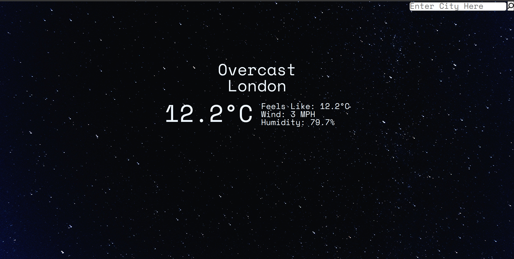

# Weather App

Weather app created with HTML, CSS and JS.

Search a location for forecast data.

- Display daily or hourly forecast data for a given location.
- Display data in metric or imperial units.
- Unique weather symbols for each forecast description.

[Live Demo](https://jabarrr.github.io/js-weather-app/) :point_left:

